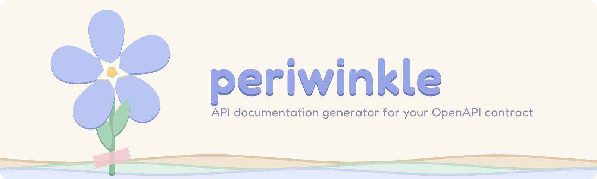

<div align="center">

[](https://github.com/phranck/periwinkle/actions/workflows/ci.yml)
[](https://phranck.github.io/periwinkle/)
[](https://layered.mit-license.org)
[](https://github.com/phranck/periwinkle/commits/main)



</div>

# periwinkle

Static API documentation generator for OpenAPI 3.x — turn a spec plus a small config into a polished, themable, self-contained docs site. Named after the violet-blooming periwinkle flower (Vinca).

**Live demo:** [phranck.github.io/periwinkle](https://phranck.github.io/periwinkle/) — built from a fictional bookstore contract on every push.

- Static output: `index.html`, one stylesheet, one small vanilla-JS bundle. No runtime framework, deployable to any host.
- Sticky top navigation with a frosted-glass backdrop: optional brand logo, home link, search, GitHub link, and theme toggle — every affordance toggleable via config.
- Sidebar navigation with endpoint groups, integration guide, endpoint blocks with generated curl examples, schema cards with field tables and raw JSON view.
- Light/dark theming via CSS custom properties, fully configurable (colors, fonts, logo, radius).
- Document search dialog (`⌘K`) and persisted collapsible sections — all progressive enhancement over working plain HTML.
- Embeddable React components for host apps (e.g. Astro via `@astrojs/react`).

## Quickstart

```bash
npm install --save-dev periwinkle
npx periwinkle build --spec openapi.json --out dist
npx periwinkle preview --dir dist
```

The spec may be JSON or YAML. Broken specs fail the build loudly — periwinkle never produces a silently wrong site.

## Configuration

Create a `periwinkle.config.ts` (or `.js`/`.mjs`) next to your project; it is discovered automatically, or passed explicitly with `--config`.

```ts
import { defineConfig } from "periwinkle";

export default defineConfig({
  spec: "openapi.json",
  site: {
    basePath: "/docs",
    serverUrl: "https://api.example.com",
    title: "Example API",
    logo: "assets/logo.svg",
    favicon: "assets/favicon.png",
  },
  theme: {
    colors: {
      light: { accent: "#6667ab" },
      dark: { accent: "#9a9bd4" },
    },
    fonts: {
      heading: '"Barlow Condensed", sans-serif',
      stylesheets: ["/fonts/fonts.css"],
    },
    radius: "1rem",
  },
  guide: {
    auth: "Send the `X-API-Key` header with every request.",
    rateLimits: "100 requests per minute per key.",
    versioning: false,
  },
  customSections: [
    {
      id: "sdks",
      title: "SDK Downloads",
      markdown: "Grab the SDKs from …",
      position: "after-reference",
    },
  ],
  footer: {
    links: [{ label: "Imprint", href: "https://example.com/imprint" }],
    text: "© Example Corp",
  },
});
```

### Reference

| Key | Purpose | Default |
| --- | --- | --- |
| `spec` | Path to the OpenAPI 3.x document (JSON or YAML) | — (or `--spec`) |
| `site.basePath` | Path the site is served under | `/` |
| `site.serverUrl` | Base URL in curl examples | first spec `servers` entry |
| `site.title` | Page title override | spec `info.title` |
| `site.logo` / `site.favicon` | Local file (bundled) or URL | — |
| `theme.colors.light` / `.dark` | Partial palette overrides | periwinkle palette |
| `theme.fonts` | Font stacks + external font stylesheets | system fonts |
| `theme.radius` | Corner radius token (cards full, compact controls half) | `1rem` |
| `navigation.*` | Top bar: `logo` (local file or URL, links to `homeHref`), `showHome`, `homeLabel`, `homeHref`, `showSearch`, `showThemeToggle`, `github` | home + search + theme toggle, no logo/GitHub |
| `sidebar.*` | `title`, `showMethods`, `showThemeToggle`, `showSearch` | `"Reference"`, all toggles `false` |
| `features.*` | `openApiContract`, `accessBadge`, `deprecatedBadge`, `copyButton` | all `true` |
| `sizing.*` / `motion.*` | Typography and layout dimensions / animation timing (CSS length and duration strings) | reference values |
| `guide.*` | Markdown per section (`intro`, `auth`, `requests`, `errors`, `rateLimits`, `versioning`), `false` disables | derived from the spec |
| `customSections` | Free Markdown sections with `position` (`before-guide`, `after-guide`, `after-reference`) | `[]` |
| `footer` | Links and text | — |

Guide sections without authored content fall back to copy derived from the spec (declared security schemes, server URL, version). Every rendered string is either derived from the spec or configurable.

## Deploying

The output directory is plain static files. Recipes:

**Any static host (nginx, GitHub Pages, …)** — upload `dist/`. With a sub-path (e.g. Pages project sites), set `site.basePath` accordingly.

**GitHub Actions → Pages** — see [`.github/workflows/pages.yml`](.github/workflows/pages.yml) in this repo; it builds the live demo.

**Hono / Node backend under `/docs`:**

```ts
import { serveStatic } from "@hono/node-server/serve-static";

app.use("/docs/*", serveStatic({ root: "./docs-dist", rewriteRequestPath: (p) => p.replace(/^\/docs/, "") }));
```

Build with `site.basePath: "/docs"` and serve the directory — no server-side rendering involved.

## Embedding in an existing app

The same components that power the CLI are exported for host apps:

```tsx
import { ApiDocs, prepareDocsData, resolveConfig } from "periwinkle";
import "periwinkle/styles.css";

const data = await prepareDocsData(openApiDocument, resolveConfig({ site: { basePath: "/docs" } }));
// e.g. in Astro with @astrojs/react:
<ApiDocs data={data} />
```

Add `periwinkle/client.js` as a deferred script for search, collapsing, and the theme toggle, and emit `compileThemeCss(config)` (it takes the full resolved config, since sizing and motion tokens compile alongside the palette) into a `<style>` tag placed after the stylesheet link. All interactivity binds via `data-pw-*` attributes; the markup works without JavaScript.

## CLI

```
periwinkle build   [--spec <file>] [--config <file>] [--out <dir>]
periwinkle preview [--dir <dir>] [--port <number>]
periwinkle --version | --help
```

## License

This repository has been published under the [MIT](https://layered.mit-license.org) license.
