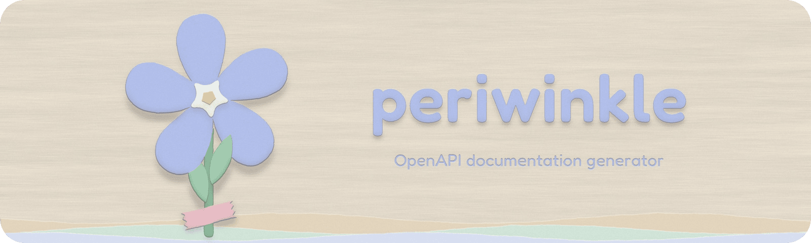

<div align="center">

[](https://github.com/phranck/periwinkle/actions/workflows/ci.yml)
[](https://phranck.github.io/periwinkle/)
[](https://www.npmjs.com/package/periwinkle)
[](https://layered.mit-license.org)
[](https://github.com/phranck/periwinkle/commits/main)



</div>

# periwinkle

periwinkle is a static API documentation generator for [OpenAPI](https://openapis.org) 3.x. It turns a specification and a small configuration file into a polished, themable, self-contained documentation site. Its name comes from the violet-blooming periwinkle flower (Vinca).

**Live demo:** [phranck.github.io/periwinkle](https://phranck.github.io/periwinkle/). The demo is rebuilt from a fictional bookstore contract on every push.

- The output is entirely static and consists of `index.html`, one stylesheet, one small vanilla-JS bundle, and a copy of the specification as `openapi.json`. No runtime framework is involved, so the site deploys to any host.
- A sticky top navigation bar with a frosted-glass backdrop carries an optional brand logo, a home link, search, a GitHub link, and a theme toggle. Every one of these affordances can be switched off in the configuration.
- The sidebar lists endpoint groups and the integration guide, whilst the main column holds endpoint blocks with generated curl examples and schema cards with field tables and a raw JSON view.
- Light and dark themes are compiled into CSS custom properties and remain fully configurable, covering the palette, fonts, logo, and corner radius. You may choose which palette first-time visitors see, or defer to their operating system.
- A document search dialog (`⌘K`) and collapsible sections that remember their state add progressive enhancement to markup which already works as plain HTML.
- React components are exported for embedding in host applications, for instance in Astro by way of `@astrojs/react`.

## Contents

- [Quickstart](#quickstart)
- [Configuration](#configuration)
- [Sidebar icons](#sidebar-icons)
- [Deploying](#deploying)
- [Embedding in an existing app](#embedding-in-an-existing-app)
- [CLI](#cli)
- [Projects using periwinkle](#projects-using-periwinkle)
- [License](#license)

## Quickstart

```bash
npm install --save-dev periwinkle
npx periwinkle build --spec openapi.json --out dist
npx periwinkle preview --dir dist
```

The specification may be written in JSON or YAML. A broken specification fails the build loudly, because periwinkle never produces a silently incorrect site.

## Configuration

Create a `periwinkle.config.ts` (or `.mts`/`.js`/`.mjs`) next to your project. It is discovered automatically, or you may pass it explicitly with `--config`. Every field is optional, and an empty configuration still produces a fully working site.

```ts
import { defineConfig } from "periwinkle";

export default defineConfig({
  spec: "openapi.json",
  site: { basePath: "/docs", title: "Example API" },
  theme: {
    colors: {
      light: { accent: "#6667ab" },
      dark: { accent: "#9a9bd4" },
    },
  },
  navigation: { logo: "assets/logo.svg", github: { url: "https://github.com/acme/api" } },
});
```

The config covers site identity, the full color palette per mode, fonts, corner radius, the top navigation bar, sidebar affordances, feature switches, typography/layout sizing, animation timing, the integration guide content, custom Markdown chapters, and the footer.

- **Full reference:** every option, its type, default, and where it appears on the page is documented in [CONFIGURATION.md](CONFIGURATION.md).
- **Interactive builder:** assemble your configuration at [phranck.github.io/periwinkle/config-builder/](https://phranck.github.io/periwinkle/config-builder/), which offers a live preview, imports an existing configuration, and either copies the result to the clipboard or saves it to a file.

  The builder is a second page periwinkle can generate, and it is **off by default**: a published API reference should not ship the tool that authors its own config. Turn it on where it belongs, as the demo does:

  ```ts
  features: { configBuilder: true },
  ```

## Sidebar icons

Endpoint groups take their sidebar icon from the tag name, so a generated reference does not repeat one mark down the whole rail. `Shops` gets a storefront, `Search` a magnifier, `Users` two avatars. Titles that are not covered keep a neutral default, and singular and plural resolve to the same entry unless the icon set offers a real plural counterpart.

The mapping lives in [`src/render/section-icons.json`](src/render/section-icons.json) and covers common API vocabulary out of the box.

To adapt it, use the **[icon picker](https://phranck.github.io/periwinkle/icon-picker.html)**: browse or search all 993 Iconsax icons in both the Bulk and TwoTone style, add your own titles, then download the JSON and save it over the mapping file. The page keeps everything in the browser and uploads nothing.

It also ships in this repository as `tools/icon-picker.html` and runs offline, with no server and no network:

```bash
open tools/icon-picker.html          # or double-click it
```

After upgrading `iconsax-react`, refresh the tool's icon data:

```bash
node tools/extract-icons.mjs
node tools/build-icon-picker.mjs
```

## Deploying

The output directory is plain static files. Recipes:

**Any static host, such as nginx or GitHub Pages.** Upload `dist/` as it stands. Where the site is served from a sub-path, as GitHub Pages project sites are, set `site.basePath` accordingly.

**GitHub Actions deploying to Pages.** See [`.github/workflows/pages.yml`](.github/workflows/pages.yml) in this repository, which builds the live demo.

**Hono / Node backend under `/docs`:**

```ts
import { serveStatic } from "@hono/node-server/serve-static";

app.use("/docs/*", serveStatic({ root: "./docs-dist", rewriteRequestPath: (p) => p.replace(/^\/docs/, "") }));
```

Build with `site.basePath: "/docs"` and serve the directory. No server-side rendering is involved.

## Embedding in an existing app

The same components that power the CLI are exported for host apps:

```tsx
import { ApiDocs, prepareDocsData, resolveConfig } from "periwinkle";
import "periwinkle/styles.css";

const data = await prepareDocsData(openApiDocument, resolveConfig({ site: { basePath: "/docs" } }));
// e.g. in Astro with @astrojs/react:
<ApiDocs data={data} />
```

Add `periwinkle/client.js` as a deferred script for search, collapsing, and the theme toggle, and emit `compileThemeCss(config)` (it takes the full resolved config, since sizing and motion tokens compile alongside the palette) into a `<style>` tag placed after the stylesheet link. All interactivity binds via `data-pw-*` attributes; the markup works without JavaScript.

## CLI

```
periwinkle build   [--spec <file>] [--config <file>] [--out <dir>]
periwinkle preview [--dir <dir>] [--port <number>]
periwinkle --version | --help
```

## Projects using periwinkle

| Project | API reference |
| --- | --- |
| [lmaa.space](https://github.com/phranck/lmaa.space), a curated directory of independent online shops in Europe | [api.lmaa.space/docs](https://api.lmaa.space/docs/) |

Built your docs with periwinkle? Add yourself to this list. Open a pull request
with one more row, or open an issue with your link and it gets added for you.
Seeing where periwinkle actually ends up is the most useful feedback this
project can get, and it helps the next person decide whether it fits their API.

## License

This repository has been published under the [MIT](https://layered.mit-license.org) license.
